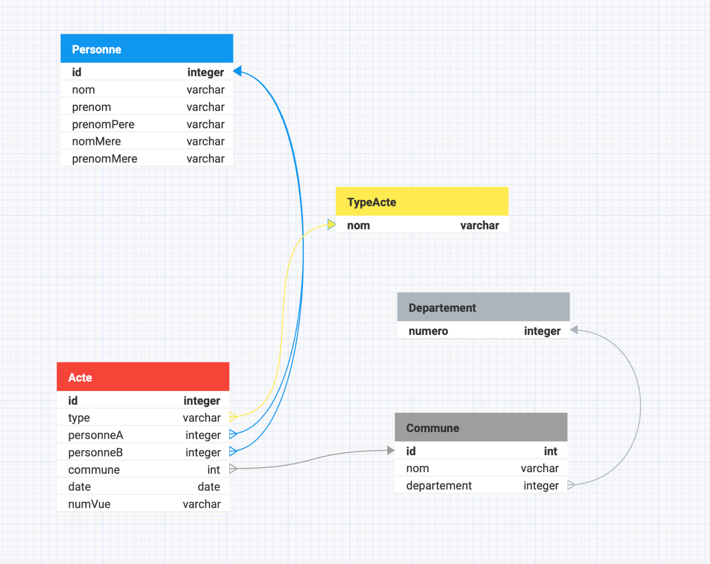
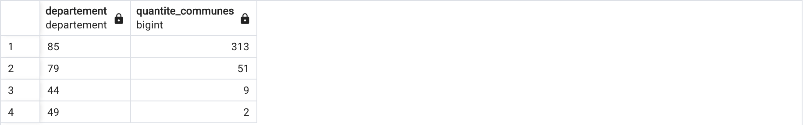
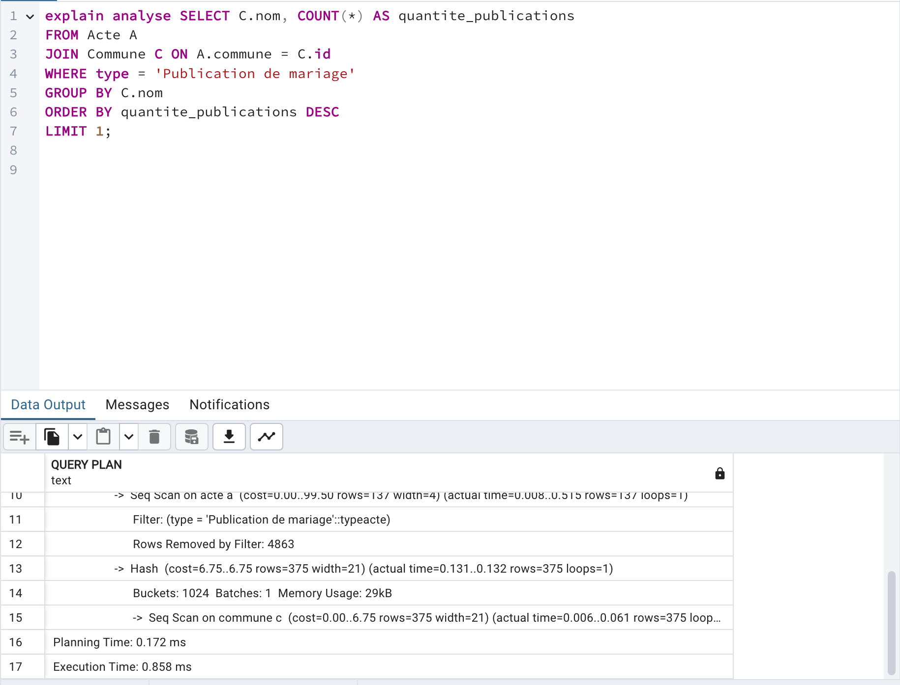
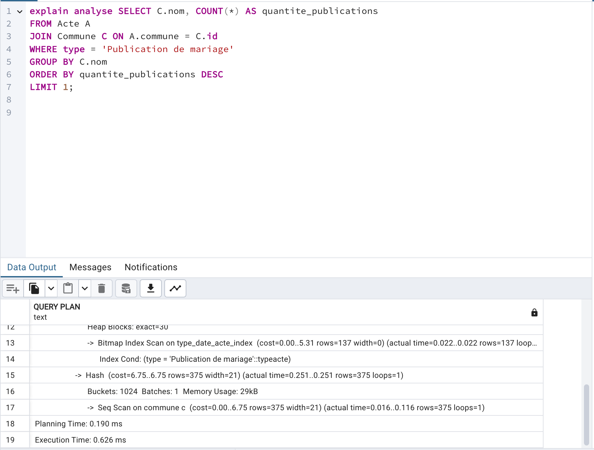
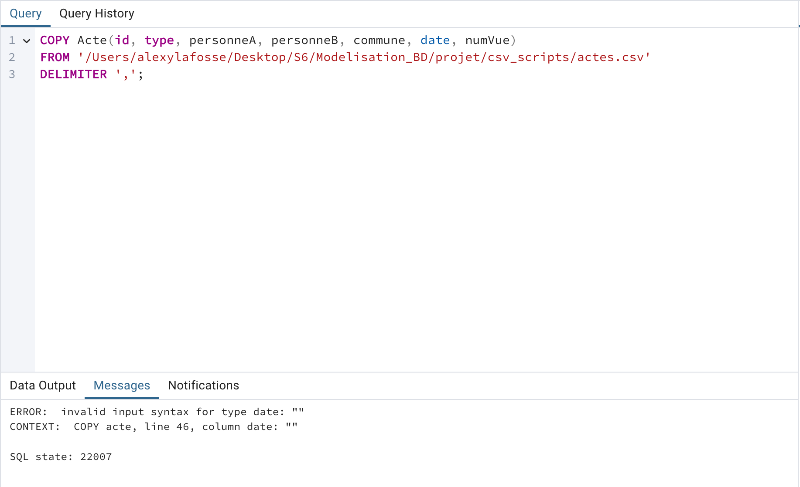

# Compte-Rendu Projet

[TOC]

## Composition

- Lafosse Alexy
- Lahrouri Yasin

## Conceptualisation et modélisation

Tout d'abord, nous avons commencé par conceptualiser nos tables ainsi que leurs attributs et leurs clés primaires/étrangères en normalisant les données issus du fichier `mariages_L3_5k.csv`.

Nous avons ensuite utilisé DB Designer pour modeliser les tables : 



### Différence DB Designer / Structure finale

##### TypeActe et Departement

Nous n'avons pas réussi à créer d'énumération sur DB Designer, donc nous avons simplement créé des tables avec un seul attribut pour pouvoir les modeliser sur ce logiciel. Cependant, nous avons utilisé dans notre structure finale, deux énumérations.

### Choix effectués

##### Trois tables

Nous avons décidé grâce à la normalisation de modéliser trois tables pour les actes, les personnes qui participent aux actes et les communes dans lesquelles se déroulent les actes.

##### Deux énumérations

Puisque nous avons une liste défini de type d'acte et de département, nous avons décidé de créer deux énumérations.

##### Attributs de la classe `Personne`

Nous avons décidé d'enregistrer le prénom du père, le nom et le prénom de la mère dans les attributs d'une personne et non pas de les enregistrer en tant que `Personne` car nous manquons d'informations à leur sujet. Nous pourrions très bien avoir un père possédant les mêmes nom et prénom que son fils ou que d'une autre personne, et nous n'aurions aucun moyen de les dissocier. Il en est de même pour la mère.

De plus, nous avons associé un id à chaque `Personne` différenciée par les cinq attributs suivants : 
- nom
- prénom
- prénom du père
- nom de la mère
- prénom de la mère

##### Attributs de la classe `Commune`

Nous avons associé un id à chaque `Commune` différenciée par les attributs suivants : 
- nom
- département

## Extraction des données

### Personne

Nous avons d'abord décidé d'extraire les données `Personne`.

Pour se faire, nous avons utilisé les commandes linux suivantes pour créer un fichier CSV `personnes.csv` sans entête :

---

```
cut -f3 -f4 -f5 -f6 -f7 -d"," mariages_L3_5k.csv > personnes_sans_id.csv
```
pour mettre les attributs des "personneA" du fichier `mariages_L3_5k.csv` dans un fichier `personnes_sans_id.csv`.

```
cut -f8 -f9 -f10 -f11 -f12 -d"," mariages_L3_5k.csv >> personnes_sans_id.csv
```
pour mettre les attributs des "personneB" du fichier `mariages_L3_5k.csv` à la suite du fichier `personnes_sans_id.csv`.

```
sort personnes_sans_id.csv | uniq > personnes_sans_id_tmp.csv
```
pour créer une nouvelle liste trié et sans doublons de la liste de personnes dans le fichier `personnes_sans_id_tmp.csv`.

```
rm personnes_sans_id.csv
```
pour supprimer le fichier `personnes_sans_id.csv` maintenant inutile.

```
awk -F, -v OFS=',' '{print NR, $0}' personnes_sans_id_tmp.csv > personnes.csv
```
pour créer une nouvelle première colonne représentant l'identifiant d'une personne dans le fichier `personnes.csv`.

```
rm personnes_sans_id_tmp.csv
```
pour supprimer le fichier `personnes_sans_id_tmp.csv` maintenant inutile.

---

### Commune

Nous avons ensuite décidé d'extraire les données `Commune`.

Pour se faire, nous avons utilisé les commandes linux suivantes pour créer un fichier CSV `communes.csv` sans entête :

---

```
cut -f13 -f14 -d"," mariages_L3_5k.csv | sort | uniq > communes_sans_id.csv
```
pour mettre les attributs des communes du fichier `mariages_L3_5k.csv` dans un fichier `communes_sans_id.csv`.

```
awk -F, -v OFS=',' '{print NR, $0}' communes_sans_id.csv > communes.csv
```
pour créer une nouvelle première colonne représentant l'identifiant d'une commune dans le fichier `communes.csv`.

```
rm communes_sans_id.csv
```
pour supprimer le fichier `communes_sans_id.csv` maintenant inutile.

---

### Acte

##### Script

Nous avons choisi de programmer un script python `script.py` pour créer un fichier `actes.csv` avec la liste de tous les actes.

Le script :

- remplace les personnes et les attributs liés par leur id respecctif
- remplace les communes et les attributs liés par leur id respecctif
- réécrit le format des dates pour qu'elles soient lisibles avec postgreSQL
- possède une entête (lié au problème Date NULL))

## Création de la BDD

### Outils

Nous avons utilisé le logiciel PgAdmin pour modéliser notre base de données.

### Scripts

##### `schema.sql`

Contient la création des tables et des énumérations

##### `import_data.sql`

Contient les requêtes pour importer les données des fichiers CSV.

##### `foreignKeys.sql`

Contient les clés étrangères des tables.

##### `queries.sql`

Contient les requêtes demandées par les généalogistes.

### Importation des données

Après avoir créé tous les fichiers CSV nécessaires, nous avons créé les requêtes permettant d'importer les données de ces fichiers.

### Création des requêtes

Nous avons par la suite écrit les requêtes représentant les demandes des généalogistes.

### Résultats des requêtes

##### La quantité de communes par département
```
SELECT departement, COUNT(*) AS quantite_communes
FROM Commune
GROUP BY departement
ORDER BY quantite_communes DESC;
```


##### La quantité d'actes à LUÇON
```
SELECT COUNT(*) AS quantite_actes
FROM Acte A
JOIN Commune C ON A.commune = C.id
WHERE C.nom = 'LUÇON';
```


##### La quantité de “contrats de mariage” avant 1855
```
SELECT COUNT(*) AS quantite_contrats_mariage
FROM Acte
WHERE type = 'Contrat de mariage' AND date < '1855-01-01';
```


##### La commune avec le plus de “publications de mariage”
```
SELECT C.nom, COUNT(*) AS quantite_publications
FROM Acte A
JOIN Commune C ON A.commune = C.id
WHERE type = 'Publication de mariage'
GROUP BY C.nom
ORDER BY quantite_publications DESC
LIMIT 1;
```


##### La date du premier et du dernier acte
```
SELECT MIN(date) AS premiere_date, MAX(date) AS derniere_date
FROM Acte;
```


## Indexes

Nous avons essayé d'utiliser des indexes pour optimiser les requêtes. Cependant, le temps d'exécution était plus ou moins le même. On a donc décidé qu'il n'y avait donc pas d'intérêt à en mettre.

Par exemple pour la requête :
```
SELECT C.nom, COUNT(*) AS quantite_publications
FROM Acte A
JOIN Commune C ON A.commune = C.id
WHERE type = 'Publication de mariage'
GROUP BY C.nom
ORDER BY quantite_publications DESC
LIMIT 1;
```

Nous avons créé l'indexe : 
```
CREATE INDEX type_date_acte_index ON Acte (type, date);
```

Sans indexe, voiçi le temps d'exécution :



Avec l'indexe : 


Nous avons fais pareil avec les autres et nous avons conclu que dans ces cas là, nous n'avions pas besoin d'indexes.

## Erreur rencontrés

### Date NULL

Nous avons rencontré un problème lors de l'insertion des données de type Date du fichier `actes.csv`. Lorsque le fichier n'a pas d'entête, une erreur empêche le chargement des données vides `''`. Alors que lorsqu'il y a une entête, aucune erreur ne survient.



